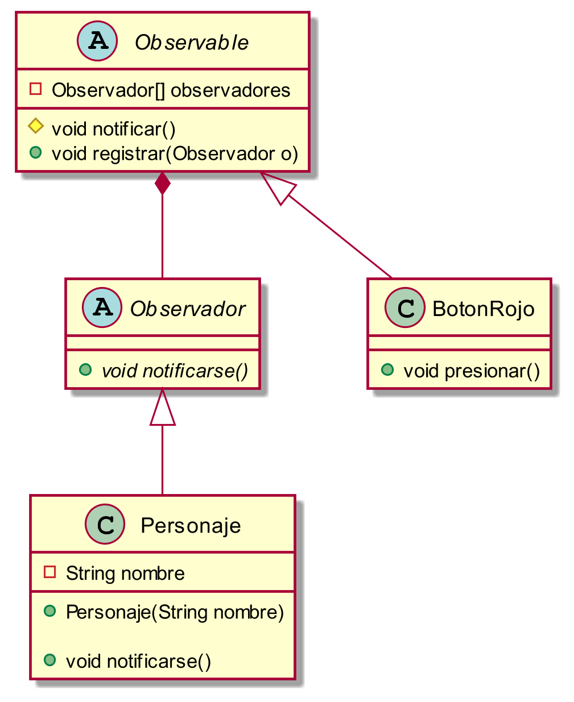
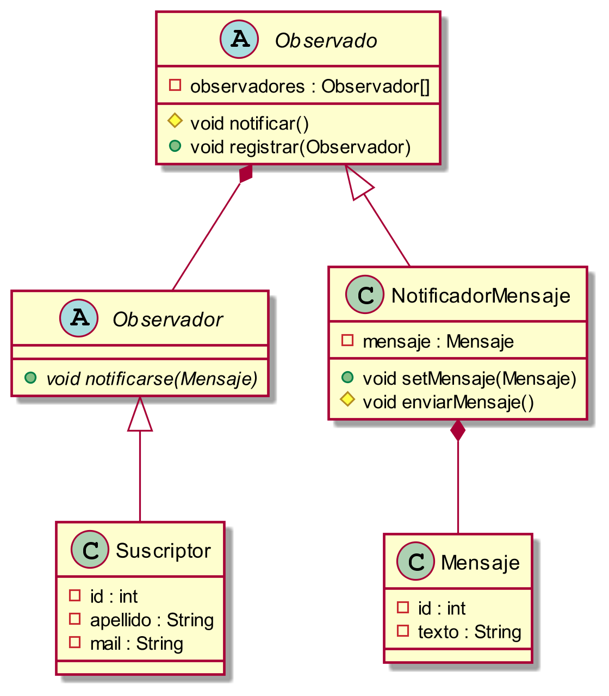

# Patrón de Diseño: Observer

## Descripción:

Observer es un patrón de diseño de comportamiento que permite definir un mecanismo de suscripción para notificar a varios objetos sobre cualquier evento que le suceda al objeto que están observando. El objeto que es observado es denominado sujeto, notificador o también publicador, mientras que los objetos interesados en conocer los cambios de estado en el notificador son llamados observadores o suscriptores. Durante esta explicación, los llamaremos notificadores y suscriptores respectivamente.

## Problemática que resuelve:

El patrón Observer la problemática que resuelve es el hecho de que los objetos que estan interesados en el cambio de estado de otro objeto no tengan que estar consultando constantemente si sucedió el cambio frente al cual ellos tienen que ejecutar determinado accionar.

## Solución que brinda:

El patrón Observer sugiere que se añada un mecanismo de suscripción a la clase notificadora para que los objetos individuales puedan suscribirse o cancelar su suscripción a un flujo de eventos que proviene de esa notificadora. El mecanismo consiste en tener en la clase notificadora un atributo que sea una lista de referencias a objetos suscriptores, y métodos que permitan añadir/quitarlos de la lista. Entonces, cuando le sucede un evento importante al notificador, recorre sus suscriptores y llama al método de notificación específico de sus objetos.

## Pasos para implementar el patrón Observer:

1. Dividir la logica de negocio en dos partes: la funcionalidad central, independiente del resto de código, que actuará como notificador; y el resto. que se convertirá en el grupo de clases suscriptoras.

2. Declarar la interfaz suscriptora, que contenga el método actualizar.

3. Declarar la interfaz notificadora com los métodos para añadir y eliminar de la lista a un objeto suscriptor.

4. Decidir dónde colocar la lista de suscripción y la implementación de los métodos de suscripción. Normalmente, este código es colocado en una clase abstracta derivada directamente de la interfaz notificadora. Los notificadores concretos extienden esa clase, heredando el comportamiento de suscripción. Sin embargo, si se está aplicando el patrón a una jerarquía de clases existentes, se debería considerar utilizar la composición: colocar la lógica de la suscripción en un objeto separado y hacer que todos los notificadores reales la utilicen.

5. Crear clases notificadoras concretas. Cada vez que suceda algo importante dentro de una notificadora, deberá notificar a todos sus suscriptores.

6. Implementar los métodos de notificación de actualizaciones en clases suscriptoras concretas. La mayoría de las suscriptoras necesitarán cierta información de contexto sobre el evento, que puede pasarse como argumento del método de notificación.

7. El cliente debe crear todos los suscriptores necesarios y registrarlos con los notificadores adecuados.

## Diagrama UML:

## Ventajas:

* Permite introducir nuevas clases suscriptoras sin tener que cambiar el código de la clase notificadora. 
* Permite establecer relaciones entre objetos durante el tiempo de ejecución.

## Desventajas:
* Los suscriptores son notificados en un orden aleatorio.

## Ejemplos:

1. Se puede utilizar observer pensando en el comportamiento de la notificación para asistir a la asamblea cuando se presiona el botón rojo, mecánica que se encuentra en el juego Among Us. Este diagrama nos permite visualizar la implementacion del patron:

2. Cuando nos registramos en alguna aplicacion del celular (como uala, steam, etc) siempre existe la opcion de recibir notificaciones al mail por algun evento/anuncio de algo nuevo. Es posible implementarlo con el patron observer, teniendo como clases concretas al suscriptor (el observador) y el notificadorMensaje (el observado). 
El notificadorMensaje va a ser el encargado de enviarle a los suscriptores un mail con un mensaje. Dicho notifacador lo va a hacer a partir de la clase abstracta Observado. Este diagrama nos permite visualizar la explicacion:

3. Un ejemplo en el cual se podría aplicar el patrón observer es en la aplicación Disney+. Imaginemos que empezamos a ver una serie, y los capítulos se estrenan semana a semana. Entonces, por mas que nosotros refresquemos la página constantemente no vamos a ver capítulos nuevos, por lo cual, nos gustaría recibir una notificación el día del estreno.
Ante este tipo de situaciones, el sistema podría utilizar el patrón observer en el que el cliente se suscribe a las notificaciones de la serie de Disney. Conviene el uso de este patrón ya que hay varias personas que están interesadas en esta serie, pero no en otras, por lo que no quieren que les llega una notificación por cada estreno de una serie en la plataforma.
Con este patrón podremos notificar a todos los suscriptores interesados los cambios de estado. Entonces, cuando sucede un evento, el notificador recorrer a sus suscriptores y llama al método de notificación específico de sus objetos.

Como podemos ver, en este diagrama tenemos:
- El Notificador proporciona una interfaz para agregar y eliminar) observadores. El Sujeto conoce a todos sus observadores.
- La interfaz suscriptora declara la interfaz de notificación
- El suscriptor concreto realiza algunas acciones en respuesta a las notificaciones emitidas por el notificador.

## Referencias
- [Explicacion mas detallada](https://refactoring.guru/es/design-patterns/observer)
- [Video con implementacion en codigo](https://www.youtube.com/watch?v=HFkZb1g8faA)